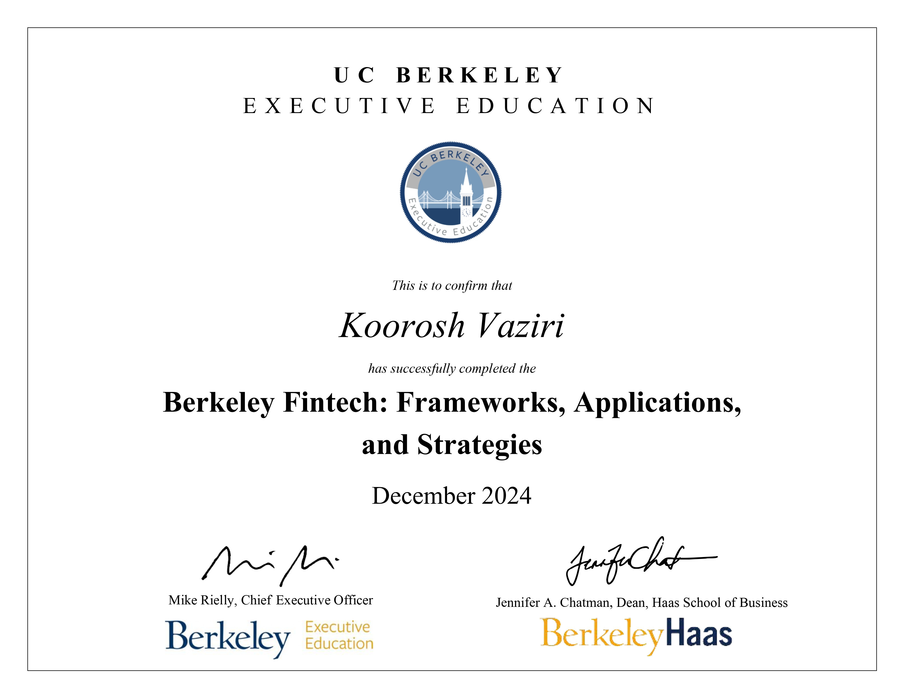

# Berkeley FinTech: Frameworks, Applications, and Strategies

This repository contains the coursework and capstone project for the **UC Berkeley Executive Education FinTech program**.

## 🚀 Capstone Project: Giftopia
With a **$900B market cap** in 2023 and minimal regulation, retail gift cards represent a massive, untapped FinTech opportunity estimated to reach **$2T by 2030**. **Giftopia** provides a strategic framework for a startup to innovate within this sector.

* **View Presentation:** [Giftopia Capstone Slides](https://github.com/kooroshvaziri/Berkeley_FinTech/blob/main/giftopia/berkeley_fintech_capstone_giftopia_final_by_kooroshvaziri.pdf)

---

